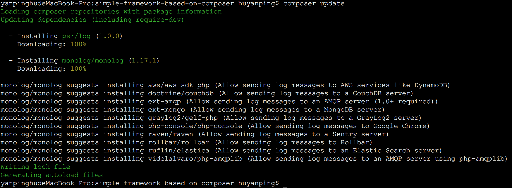
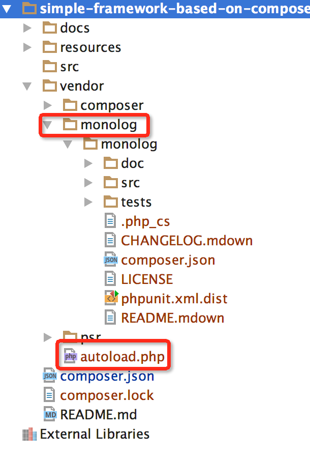

# 第一章 PSR规范与Composer

## PSR规范产生的原因
12年以前,PHP的框架数量非常多,各有各优势与劣势;这些框架的模块互不共享,轮子满天飞。
造成这种现象的原因是PHP在标准化方面的先天缺失。这些缺失包括:
+ 命名空间的出现较晚,推广使用情况比较差,不同package共生的情况下可能出现函数、类名冲突等
+ 没有统一的自动加载规则,不同的package难以实现兼容的自动加载器
+ PHP的代码风格非常灵活,没有统一的代码风格
+ 基于pecl的包管理机制,在没有命名空间支持的情况下,使用率并不理想

为了让"世界上最好的语言"继续保持辉煌,终于有人看不下去了。PHP FIG，FIG 是 Framework Interoperability Group（框架可互用性小组）于09年
成立,其目的在于：通过框架作者或者框架的代表之间讨论，以最低程度的限制，制定一个协作标准，各个框架遵循统一的编码规范，
避免各家自行发展的风格阻碍了PHP的发展，解决这个程序设计师由来已久的困扰。目前已表决通过了6套标准，已经得到大部分PHP框架的支持和认可:
+ [PSR-1 基础编码规范](https://phphub.org/topics/2078)
+ [PSR-2 编码风格规范](https://phphub.org/topics/2079)
+ [PSR-3 日志接口规范](https://phphub.org/topics/2080)
+ [PSR-4 自动加载规范](https://phphub.org/topics/2081)
+ [PSR-6 缓存接口规范](https://phphub.org/topics/2082)
+ [PSR-7 HTTP消息接口规范](https://github.com/summerblue/psr.phphub.org/blob/master/psrs/%E3%80%8CPSR%20%E8%A7%84%E8%8C%83%E3%80%8DPSR-7%20HTTP%20%E6%B6%88%E6%81%AF%E6%8E%A5%E5%8F%A3%E8%A7%84%E8%8C%83.md)

## Composer
而Composer作为做成功的PSR规范推行者应运而生;Composer根据PSR规范的编码风格,自动加载等规范,统一并给出了PHP Package编写的方案;这些package
可以轻松的相互依赖而不必担心命名冲突、自动加载、代码风格的问题。当下的流行框架大多已经基于Composer做了重构,目前最流行的Laravel框架也是基于Compser实现。

Composer这么牛,会不会很难玩?其实很简单:
+ [安装Composer](https://getcomposer.org/download/)
+ 在项目根目录创建composer.json文件,类似如下:
```json
{
  "name": "jenner/simple_framework_based_on_composer", // 你的包名:组织名/包名
  "license": "MIT", // 开源协议
  "authors": [ // 作者信息
    {
      "name": "Jenner",
      "email": "hypxm@qq.com",
      "homepage" : "http://www.huyanping.cn"
    }
  ],
  "require": { // 依赖信息
    "php": ">=5.4.0",
    "monolog/monolog": "1.17.1"
  },
  "autoload": { // 自动加载规则
    "psr-4": {
      "Jenner\\SimpleFramework\\": "src/"
    }
  }
}
```
这里我们使用了当下比较流行的日志模块monolog最为示例。
+ 执行`composer install`,composer会自动生成一个vendor文件夹,其中包涵vendor/autoload.php统一自动加载文件以及依赖的monolog源码,以及`require`配置中的依赖包
+ 执行结果和过程如下图:  
composer update执行过程  
  
目录结构  
  

## [Packagist](http://packagist.org)
有了package,就要有公开的package托管机构,packagist应运而生,目前绝大多数的package都托关于packagist;它支持github等开源的代码托管仓库,
只需要简单的填写项目地址即可将项目倒入到packagist中。使用方法可参考:[composer之创建自己的包](http://www.huyanping.cn/composer%E4%B9%8B%E5%88%9B%E5%BB%BA%E8%87%AA%E5%B7%B1%E7%9A%84%E5%8C%85/)